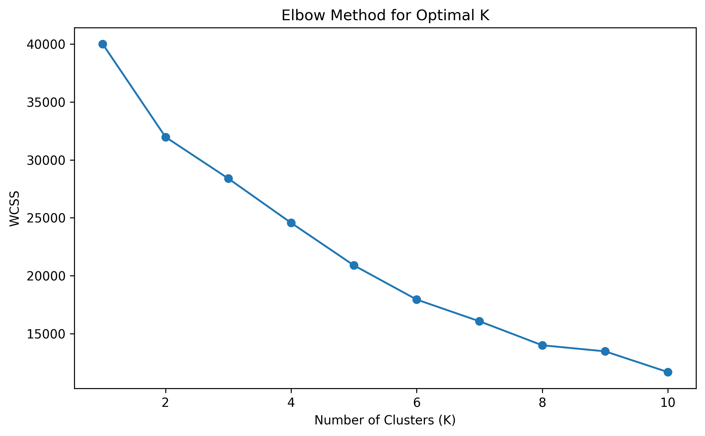
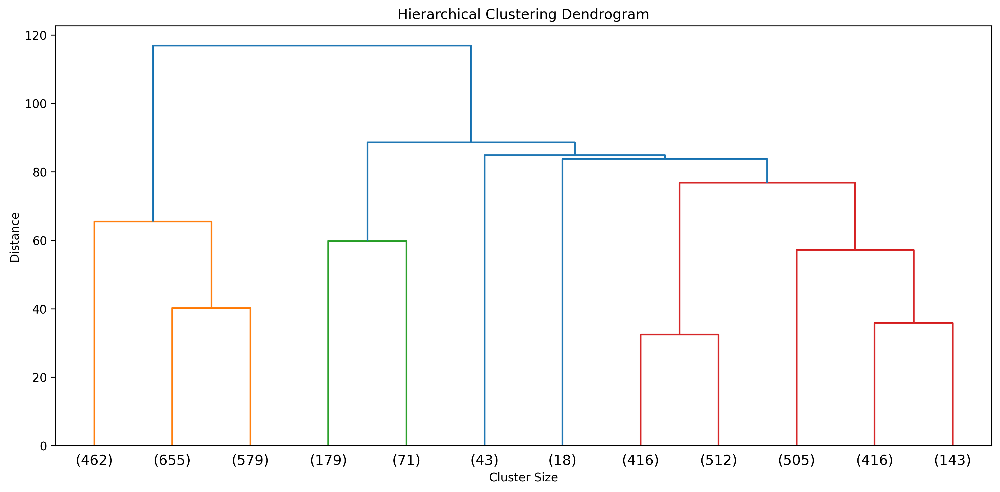

# ✈️ Airlines Customer Segmentation using Clustering

Customer segmentation of **East–West Airlines frequent flyer data** using **K-Means** and **Hierarchical Clustering**.  
The project identifies distinct passenger groups based on **flying behavior**, **reward usage**, and **credit card activity**, and draws **data-driven business inferences**.

---

## 📑 Table of Contents

- [🎯 Project Objective](#-project-objective)
- [📊 Dataset Description](#-dataset-description)
- [🧹 Data Preprocessing](#-data-preprocessing)
- [🔵 K-Means Clustering](#-k-means-clustering)
- [🌳 Hierarchical Clustering](#-hierarchical-clustering)
- [🧩 Cluster Interpretation & Characteristics](#-cluster-interpretation--characteristics)
- [📌 Final Conclusions](#-final-conclusions)
- [🛠️ Tech Stack](#️-tech-stack)
- [📁 Repository Structure](#-repository-structure)
- [👨‍💻 Authors and Contact](#-authors-and-contact)

---

## 🎯 Project Objective

East–West Airlines aims to understand its frequent flyer customers in terms of:

- ✈️ Flying patterns  
- 🎁 Reward earning and redemption behavior  
- 💳 Airline credit card usage  

The objective is to **identify homogeneous customer segments** using **unsupervised learning (clustering)** techniques and to draw **actionable business inferences** that can support targeted marketing and loyalty strategies.

---

## 📊 Dataset Description

The dataset contains information on customers enrolled in the airline’s frequent flyer program.

### Key Variables
- **Balance** – Miles available for award travel  
- **Qual_miles** – Miles qualifying for elite (Topflight) status  
- **cc1_miles, cc2_miles, cc3_miles** – Credit card usage (binned: 1–5)  
- **Bonus_miles** – Miles earned from non-flight activities  
- **Bonus_trans** – Number of non-flight bonus transactions  
- **Flight_miles_12mo** – Flight miles in the past 12 months  
- **Flight_trans_12** – Flight transactions in the past 12 months  
- **Days_since_enroll** – Days since enrollment in the program  
- **Award?** – Whether an award (free) flight was redeemed  

> The identifier column `ID#` is excluded from clustering as it does not provide behavioral information.

---

## 🧹 Data Preprocessing

To ensure meaningful distance-based clustering, the following preprocessing steps were performed:

- Removed non-informative identifier (`ID#`)
- Applied **log transformation** to highly skewed continuous variables:
  - Balance  
  - Qual_miles  
  - Bonus_miles  
  - Flight_miles_12mo  
- Applied **StandardScaler** to standardize all clustering features
- Excluded `Award?` from clustering (used only for post-cluster interpretation)

📌 These steps prevent variables with large scales or skewness from dominating distance calculations.

---

## 🔵 K-Means Clustering

### 🔹 Optimal Number of Clusters – Elbow Method

The **Elbow Method** was used to identify the optimal number of clusters by plotting the **Within-Cluster Sum of Squares (WCSS)** against different values of K.

### 📉 Elbow Plot


### Interpretation
- A sharp decrease in WCSS is observed up to **K = 4**
- Beyond K = 4, reductions in WCSS are marginal

✅ **Optimal number of clusters selected: 4**

---

## 🌳 Hierarchical Clustering

### 🔹 Methodology
- **Distance metric:** Euclidean  
- **Linkage method:** Ward’s method  

### 🌳 Dendrogram


### Interpretation
- The dendrogram shows a large vertical gap before merging beyond four clusters
- A horizontal cut at this level yields **4 distinct clusters**

✅ This result **confirms the K-Means solution**, indicating robust segmentation.

---

## 🧩 Cluster Interpretation & Characteristics

Cluster numbers are **algorithm-assigned identifiers** and do not carry intrinsic meaning.  
Interpretation is based on **relative differences in behavioral variables**.

---

### 🟢 Cluster with Very Low Flight & Reward Activity  
(**Inactive / Dormant Customers**)

**Characteristics**
- Very low flight miles and flight transactions  
- Minimal bonus miles and bonus transactions  
- Low credit card usage  
- Rare award redemption  

**Inference**
- Customers are largely inactive or disengaged from the airline.

---

### 🔵 Cluster with High Bonus Miles & Credit Card Usage  
(**Credit Card / Bonus-Driven Customers**)

**Characteristics**
- High bonus miles and bonus transactions  
- Strong credit card usage  
- Low flight activity  

**Inference**
- Customers earn miles primarily through non-flight spending rather than flying.

---

### 🟠 Cluster with High Flight & Qualifying Miles  
(**Frequent Flyers / Business Travelers**)

**Characteristics**
- Highest flight miles and flight transactions  
- Very high qualifying miles  
- High award redemption  

**Inference**
- Core airline customers and key revenue contributors.

---

### 🔴 Small Cluster with High Balance & Low Redemption  
(**Elite Niche Customers**)

**Characteristics**
- Very high mileage balance  
- Moderate flight activity  
- Low award redemption  
- Very small cluster size  

**Inference**
- High-value customers who accumulate miles and redeem selectively, often saving for premium rewards.

---

## 📌 Final Conclusions

- Both **K-Means** and **Hierarchical Clustering** identified **four meaningful customer segments**
- The optimal number of clusters is **validated across methods**
- Clear differences exist across clusters in:
  - Flying behavior  
  - Reward accumulation and redemption  
  - Credit card dependency  
- The segmentation provides actionable insights for:
  - Targeted marketing campaigns  
  - Loyalty program optimization  
  - Customer value management  

---

## 🛠️ Tech Stack

- Python  
- NumPy  
- Pandas  
- Matplotlib  
- Seaborn  
- Scikit-learn  
- SciPy  

---

## 📁 Repository Structure

```
airlines-customer-segmentation-clustering/
│
├── data/
│   └── EastWestAirlines.xlsx
│
├── notebooks/
│   └── airlines_clustering.ipynb
│
├── reports/
│   └── airlines_clustering.html
│
├── images/
│   ├── elbow_plot.png
│   └── dendrogram.png
│
├── requirements.txt
└── README.md
```

---

## 👨‍💻 Author & Contact
**Author:** Mohd Walid Ansari  
**Email:** [walidmohd2532001@gmail.com](mailto:walidmohd2532001@gmail.com)  
**GitHub:** [mohdwalid253](https://github.com/mohdwalid253)   
**LinkedIn:** [Mohd Walid Ansari](https://www.linkedin.com/in/mohdwalidansari/)