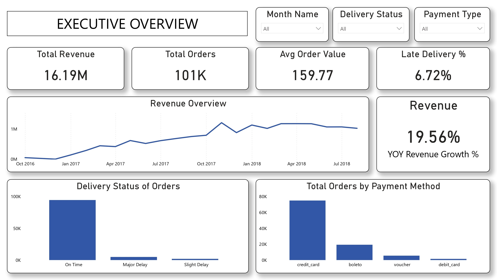
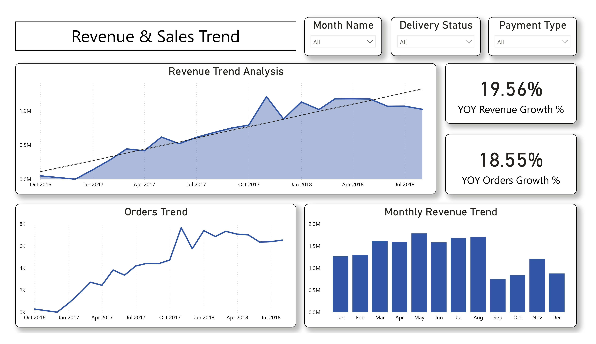
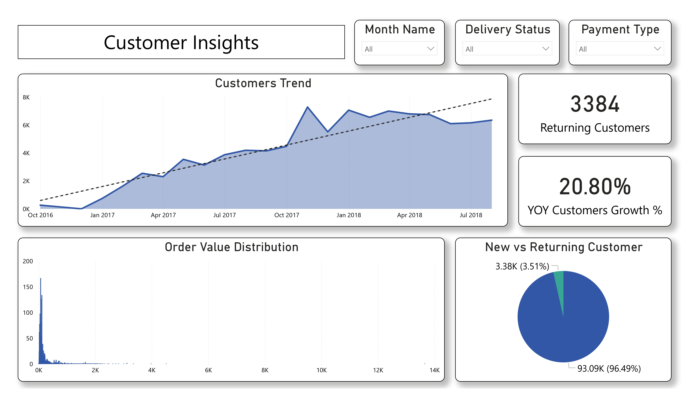
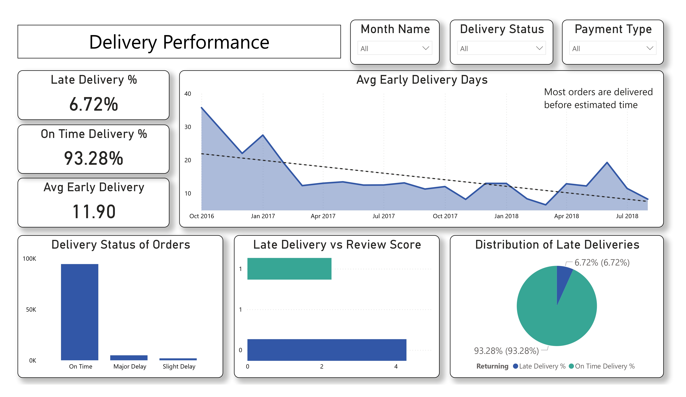

# 📊 E-Commerce Business Intelligence & Logistics Analytics
### Transforming 100K+ Transactions into Actionable Retention Strategies

---

## 📑 Table of Contents
1. [📖 Project Overview](#-project-overview)
2. [🎯 Business Problem & Objectives](#-business-problem--objectives)
3. [🛠️ Tech Stack & Tools](#️-tech-stack--tools)
4. [⚙️ Data Engineering & SQL Intelligence](#️-data-engineering--sql-intelligence)
5. [📈 Statistical Validation of Key Insights](#-statistical-validation-of-key-insights)
6. [🤖 Predictive Churn Modeling](#-predictive-churn-modeling)
7. [📊 Visual Intelligence (Dashboards)](#-visual-intelligence-dashboards)
8. [🔍 Key Business Insights](#-key-business-insights)
9. [📌 Business Impact & Strategic Recommendations](#-business-impact--strategic-recommendations)
10. [🚀 Conclusion](#-conclusion)
11. [📁 Repository Structure](#-repository-structure)
12. [👨‍💻 Author & Contact](#-author--contact)

---

## 📖 Project Overview
Most e-commerce businesses focus on **customer acquisition**, but revenue growth can often mask deep-rooted operational inefficiencies. Using the **Brazilian Olist dataset (100K+ records)**, I developed an end-to-end analytics ecosystem that moves from raw data engineering to executive-level intelligence. By connecting logistics performance directly to customer satisfaction and financial value, this project provides a data-driven roadmap to shift a business from **leaky-bucket growth** to **sustainable retention.**

The project was further extended with a machine learning-based churn prediction framework using Random Forest modeling to identify high-risk customers and simulate retention intervention strategies.

---

## 🎯 Business Problem & Objectives
High-growth platforms often struggle to answer critical questions that affect the bottom line. This project was designed to solve:
* **The Retention Paradox:** Why are ~96% of customers one-time buyers despite steady revenue?
* **Logistics Friction:** To what extent do delivery delays damage brand equity and review scores?
* **Financial Leakage:** Where are the opportunities to increase Average Order Value (AOV) through payment behavior?
* **Operational Health:** How can we visualize complex fulfillment cycles into a simple decision-support system?

**Primary Objectives:**
1.  Analyze **revenue trends and growth patterns** to identify peak performance periods.
2.  Evaluate **delivery performance** and quantify its direct impact on customer satisfaction.
3.  Understand **customer behavior** to identify homogeneous segments for targeted loyalty strategies.
4.  Build **decision-support systems** that transform raw data into visual strategy.
5. Develop a predictive churn analytics pipeline to identify at-risk customers and estimate retention opportunities.

---

## 🛠️ Tech Stack & Tools
* **SQL (Google BigQuery):** Advanced data transformation, view orchestration, and business logic implementation.
* **Python (Pandas, Matplotlib, Seaborn, SciPy, Scikit-learn):** Exploratory Data Analysis (EDA) and rigorous statistical testing.
* **Power BI:** Professional dashboard development for executive and operational stakeholders.
* **Jupyter Notebook / Colab:** Research documentation and reproducible analysis.

---

## ⚙️ Data Engineering & SQL Intelligence
Instead of performing analysis on raw, fragmented tables, I engineered a robust **Business Intelligence Layer** in BigQuery.

* **Modular Data Orchestration:** Created dedicated SQL views for **Delivery, Revenue, Reviews, and Payments** to isolate key business domains.
* **Unified Master Layer:** Joined 5+ relational tables into a consolidated `master_orders_features` dataset for high-speed analysis.
* **Metric Engineering:** Used SQL to derive complex KPIs including **Delivery Precision** (Actual vs. Estimated), **Late Delivery Flags**, and **High-Value Order** categorization.
* **Cohort Identification:** Implemented logic to track customer acquisition trends and distinguish between first-time and returning users.

---

## 📈 Statistical Validation of Key Insights
I used Python to move beyond observation, applying statistical methods to ensure all findings were mathematically significant (p < 0.05).

1.  **Logistics vs. Satisfaction:** Proved via hypothesis testing that late deliveries correlate with a **~2.0 point drop** in review scores.
2.  **Revenue Drivers:** Identified that **Credit Card users** have a **~21 BRL higher AOV** compared to other payment types (Validated via ANOVA).
3.  **Revenue Correlation:** Found a **moderate correlation (~0.49)** between order value and freight cost, highlighting significant shipping price sensitivity among customers.
4.  **The Retention Gap:** Discovered that **96% of the 100K+ customers** are one-time buyers, identifying a critical failure in the post-purchase funnel.
5.  **Behavioral Distribution:** Performed deep EDA to map the distribution of order values and delivery delay patterns across different regions.

---
## 🤖 Predictive Churn Modeling

To move beyond descriptive analytics, the project was extended into a machine learning-based customer churn prediction framework.

### Modeling Workflow
* Engineered customer-level behavioral features from transactional ecommerce data
* Applied temporal train-test separation to prevent future information leakage
* Built a Random Forest classification model to predict customer churn risk
* Evaluated model performance using Accuracy, Recall, F1-score, and ROC-AUC metrics
* Simulated retention intervention strategies using predicted churn probabilities

### Key Predictive Insights
* Operational variables such as delivery performance and freight cost emerged as the strongest churn drivers
* The model identified **12K+ high-risk customers** for potential retention targeting
* Simulated retention campaigns demonstrated projected churn reduction opportunities of approximately **15%**
* Estimated retention simulations suggested potential protection of approximately 384K BRL in customer revenue
---

## 📊 Visual Intelligence (Dashboards)
I translated complex datasets into four strategic Power BI dashboards to drive data-informed decision-making.

### 1️⃣ Executive Overview
Focuses on core KPIs: Revenue, Total Orders, AOV, and the Late Delivery % rate.


### 2️⃣ Revenue & Growth Trends
Analyzes monthly revenue growth and provides Year-over-Year (YoY) comparisons.


### 3️⃣ Customer Behavior Insights
Visualizes customer distribution, order value patterns, and the retention gap.


### 4️⃣ Delivery & Operational Performance
Evaluates delivery efficiency metrics and their direct impact on customer ratings.


---

## 🔍 Key Business Insights
* **Retention Warning:** Approximately **96% of customers (90K+) are one-time buyers**, indicating a critical lack of post-purchase engagement.
* **Credit Card Value:** Credit cards aren't just a payment method; they are a driver of higher-value purchases, suggesting that optimizing payment partnerships could directly increase AOV.
* **Logistics is Marketing:** Customer satisfaction is driven more by **delivery speed** than product price; a single day of delay has a measurable negative impact on brand perception.
* **Seasonal Stability:** While 2017 showed explosive growth, 2018 showed stabilization, suggesting the market is maturing and requires a shift toward efficiency.

---

## 📌 Business Impact & Strategic Recommendations

By integrating SQL engineering with statistical rigor, this project transitioned from raw data analysis to a strategic diagnostic tool, delivering the following impacts and actionable roadmaps:

### 🚀 Business Impact
* **Identified a Critical Retention Gap:** Exposed that **96% of the 100K+ customers** are one-time buyers, proving that current revenue growth is unsustainably dependent on new acquisition rather than brand loyalty.
* **Quantified Operational Loss:** Statistically linked logistics to brand equity, proving that delivery delays cause a measurable **2.0 point drop** in customer satisfaction scores.
* **Unlocked Revenue Drivers:** Discovered that specific payment behaviors (Credit Cards) correlate with a **~21 BRL increase** in Average Order Value (AOV).
* **Optimized Decision-Making:** Developed a unified Business Intelligence layer that tracks **5+ real-time KPIs**, reducing the time required for executive performance reviews.
* **Enabled Predictive Retention Targeting:** Built a churn prediction framework capable of identifying 12K+ high-risk customers and supporting simulated retention intervention strategies.

### 💡 Strategic Recommendations
1.  **Pivot to Retention Marketing:** Shift budget from cold acquisition to loyalty-driven campaigns (e.g., personalized "Welcome Back" offers) to convert the 96% one-time buyer base into repeat customers.
2.  **Optimize Fulfillment Benchmarks:** Focus logistics improvements on reducing the "Actual vs. Estimated" delivery gap, as this specific metric is the primary driver of negative reviews.
3.  **Incentivize High-Value Payments:** Since credit card users spend significantly more, implement targeted promotions or cashback rewards for credit transactions to naturally lift the platform's overall AOV.
4.  **Regional Freight Strategy:** Adjust shipping subsidies or carrier partnerships in regions with high freight-to-order-value correlations (~0.49) to reduce price sensitivity and cart abandonment.

---

## 🚀 Conclusion
This project demonstrates that **Data Analytics is not just about counting things—it’s about weighing them.** By connecting SQL engineering with statistical rigor and visual storytelling, I was able to:
* 📉 **Expose** the hidden retention problem behind positive growth numbers.
* 🚚 **Quantify** the financial cost of operational delays.
* 💳 **Identify** the specific customer behaviors that drive higher revenue.
* 🛠️ **Build** a repeatable framework that turns raw transactional logs into a strategic roadmap.

The addition of predictive churn modeling further extended the project from descriptive business intelligence into proactive customer retention analytics.

---

## 📁 Repository Structure
```
ecommerce-analytics-project/
│
├── data/
│   ├── raw/                         # ignored
│   ├── processed/
│   │   ├── customer_churn_modeling_dataset.csv
│   │   ├── high_risk_customers.csv
│   │   └── olist_master_orders_features.csv
│   └── analytics/
│       ├── 07_01_revenue_trend.csv
│       ├── 07_02_delivery_performance.csv
│       ├── 07_03_customer_retention.csv
│       └── 07_04_cohort_analysis.csv
│
├── sql/
│   ├── 01_create_delivery_view.sql
│   ├── 02_create_revenue_view.sql
│   ├── 03_create_review_view.sql
│   ├── 04_create_payment_view.sql
│   ├── 05_create_master_table.sql
│   ├── 06_feature_engineering.sql
│   ├── 07_01_revenue_trend.sql
│   ├── 07_02_delivery_performance.sql
│   ├── 07_03_customer_retention.sql
│   ├── 07_04_cohort_analysis.sql
│   └── 08_export_master_orders_features.sql
│
├── notebooks/
│   ├── 01_eda.ipynb
│   ├── 02_hypothesis_testing.ipynb
│   ├── 03_sql_business_analysis.ipynb
│   └── 04_churn_prediction.ipynb
│
├── dashboard/
│   ├── olist_dashboard.pbix
│   ├── Business_Performance_Dashboard.pptx
│   └── olist_dashboard.pdf
│
├── images/
│   ├── sql_outputs/                 # from BigQuery 
│   │   ├── 07_01_revenue_trend.png
│   │   ├── 07_02_delivery_performance.png
│   │   ├── 07_03_customer_retention.png
│   │   └── 07_04_cohort_analysis.png
│   │
│   └── dashboard/                  # Power BI screenshots
│       ├── 01_executive_overview.jpg
│       ├── 02_revenue_trends.jpg
│       ├── 03_customer_insights.jpg
│       └── 04_delivery_performance.jpg
│
├── .gitignore
├── requirements.txt
└── README.md
```
---

## 👨‍💻 Author & Contact
**Mohd Walid Ansari**
*Data Analyst | Problem Solver*

* **Email:** [walidmohd2532001@gmail.com](mailto:walidmohd2532001@gmail.com)
* **LinkedIn:** [Mohd Walid Ansari](https://linkedin.com/in/mohd-walid-ansari-8982362b5/)
* **GitHub:** [@mohdwalid253](https://github.com/mohdwalid253)

---
⭐ *If you find this project insightful, feel free to star the repository!*